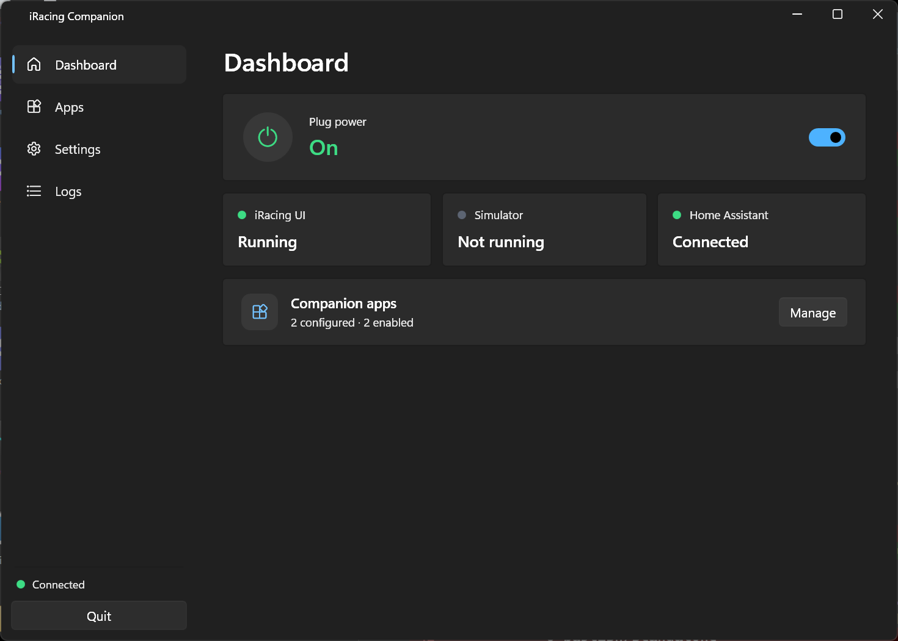
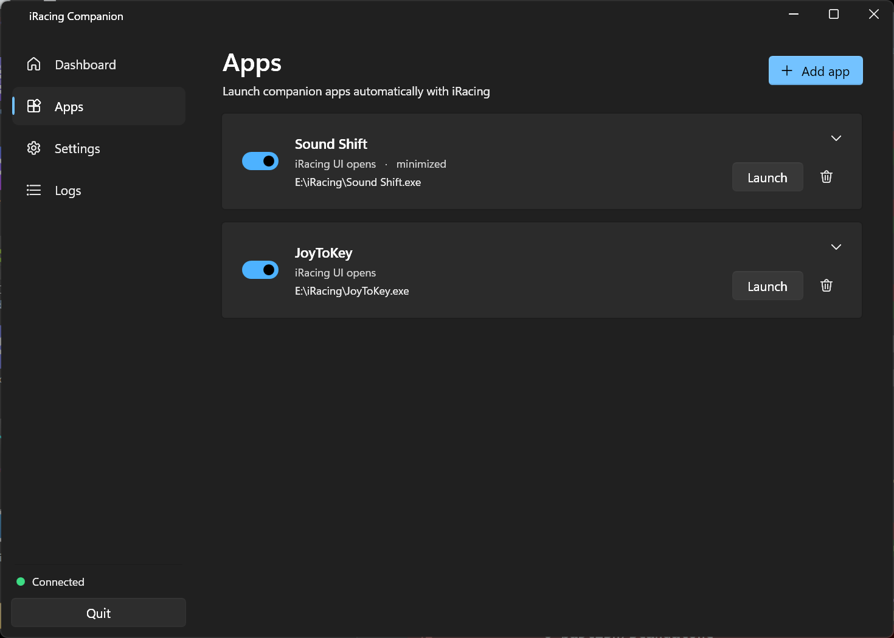

# iRacing Companion

A small Windows tray app for sim racing, written in WPF on .NET 10.

What it does:

- Turns a Home Assistant smart plug on when iRacing starts, and off a little while after it closes. The off delay is configurable.
- Starts companion apps automatically (Sound Shift, JoyToKey, RaceLab, whatever you use). Each one can launch when the iRacing UI opens or when the sim actually goes on track, and you can pass it arguments or start it minimized.
- Sits in the system tray with a Windows 11 dark theme. It's single instance, can start with Windows, minimizes and closes to the tray, and remembers its window size.

## Screenshots

Dashboard:



Apps:



## Downloads

Every push to main builds the app on GitHub Actions. You can grab the exe from the Actions tab under the run artifacts, or from a release if a version tag was pushed. There are two builds:

- `iRacingCompanion.exe` is small, but it needs the .NET 10 Desktop Runtime installed on the machine (a one time install from Microsoft).
- `iRacingCompanion-portable.exe` is bigger but fully self contained, so it runs on any Windows x64 machine with nothing installed.

## Building

You need the .NET 10 SDK.

Run it locally:

```
dotnet run
```

Build the framework-dependent exe (needs the runtime):

```
dotnet publish IRacingSmartPlug.csproj -c Release -r win-x64 --self-contained false -p:PublishSingleFile=true -o publish
```

Build the portable, self-contained exe:

```
dotnet publish IRacingSmartPlug.csproj -c Release -r win-x64 --self-contained true -p:PublishSingleFile=true -p:IncludeNativeLibrariesForSelfExtract=true -o publish
```

## Config

Settings are stored in %APPDATA%\iRacingSmartPlug\config.json, which is not committed to the repo. You set up Home Assistant, the behavior options and your companion apps from the Settings and Apps pages in the app.
